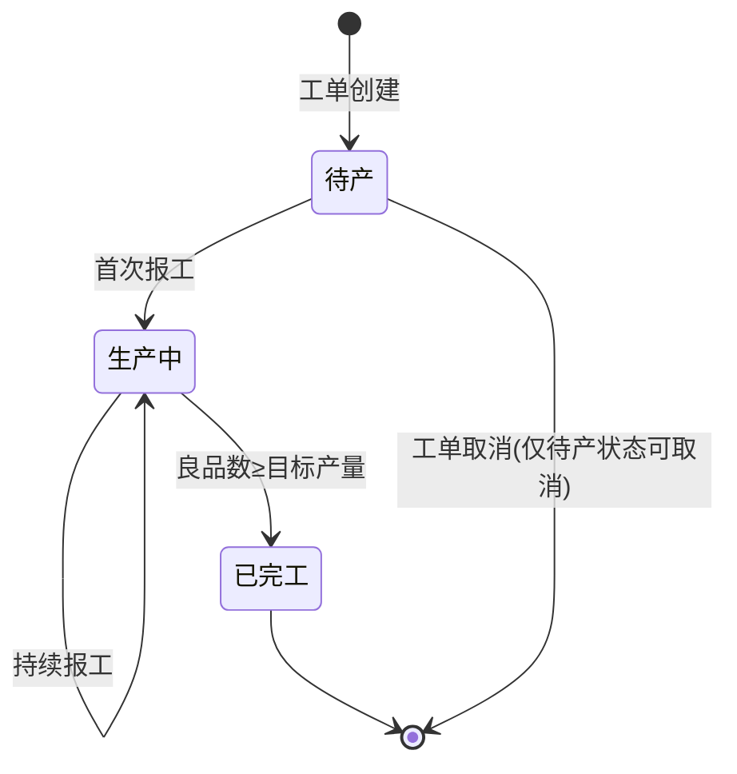
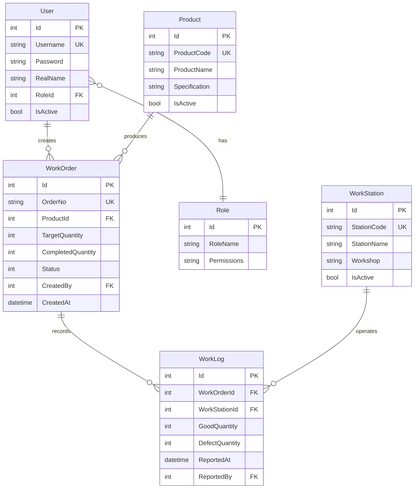

# 产品需求文档 (PRD)：迷你制造执行系统 (Mini MES)

## 1. 产品概述

### 1.1 产品定位

本系统是一个轻量级的制造执行系统 (MES)，旨在解决车间现场最核心的生产管理痛点：**”生产什么、在哪里生产、生产了多少、良率如何”**。系统通过数字化的工单流转和工位报工，实现生产进度的实时透明化。

### 1.2 目标用户

| 角色       | 职责                         | 主要使用功能                 |
| ---------- | ---------------------------- | ---------------------------- |
| 系统管理员 | 系统配置、用户管理、权限分配 | 用户管理、角色配置、系统设置 |
| 技术员     | 维护基础数据（产品、工位）   | 产品管理、工位管理           |
| 计划员     | 下发生产工单、监控生产进度   | 工单下发、工单查询、生产看板 |
| 操作工     | 执行生产任务、提交报工数据   | 报工提交、工单查询           |
| 质检员     | 查看质量数据、追溯生产记录   | 报工明细查询、良率分析       |
| 管理层     | 查看生产数据、决策支持       | 生产看板、统计报表           |

### 1.3 核心价值

- **透明化**：实时掌握生产进度和质量状况
- **数字化**：纸质工单转为电子化流转
- **可追溯**：完整记录生产过程，支持质量追溯
- **轻量化**：聚焦核心功能，快速部署上线

## 2. 核心业务流程

业务流转严格遵循单向闭环，避免复杂的逆向流程（如返工返修），以降低初期开发复杂度。

### 2.1 标准流程

1. **准备期**：技术员录入基础的【产品字典】和【工位档案】。
2. **计划期**：计划员根据订单下发【生产工单】，明确目标产量，工单进入”待产”状态。
3. **执行期**：车间操作工或设备在指定工位上执行生产，并高频提交【报工日志】（包含良品数、不良品数）。
4. **反馈期**：系统自动汇总报工数据，实时更新工单进度；当良品数达标时，自动流转工单状态为”已完工”。

### 2.2 工单状态流转图

### 2.3 异常场景处理

| 异常场景 | 处理方式                                         |
| -------- | ------------------------------------------------ |
| 工单取消 | 仅允许”待产”状态的工单取消，已开工的工单不可取消 |
| 工位故障 | 工位状态设为”停用”，不影响已有报工记录           |
| 超产情况 | 允许良品数超过目标产量，系统记录实际产量         |
| 报工错误 | 支持报工记录的修改和删除（需权限控制）           |
| 产品停产 | 产品状态设为”停用”，不影响历史工单               |

## 3. 功能需求详细说明 (核心五模块)

### 3.1 用户权限管理模块 (User & Auth)

提供用户身份认证和权限控制，确保系统安全。

| 功能名称     | 功能描述                         | 核心字段要求                             |
| ------------ | -------------------------------- | ---------------------------------------- |
| **用户管理** | 维护系统用户账号，支持增删改查。 | 用户名 (唯一)、密码、姓名、角色、状态。  |
| **角色管理** | 定义角色及其权限范围。           | 角色名称、权限列表。                     |
| **登录认证** | 用户登录验证，颁发访问令牌。     | 用户名、密码验证，返回令牌和用户信息。   |
| **权限校验** | 接口级别的权限拦截。             | 基于令牌解析用户角色，校验接口访问权限。 |

### 3.2 基础数据管理模块 (Master Data)

为系统提供基础档案支撑，所有业务数据均需关联基础数据。

| 功能名称     | 功能描述                                             | 核心字段要求                                                |
| ------------ | ---------------------------------------------------- | ----------------------------------------------------------- |
| **产品管理** | 维护工厂可生产的产品种类目录，支持增删改查。         | 产品编码 (全局唯一)、产品名称、规格型号、状态 (启用/停用)。 |
| **工位管理** | 维护车间物理工作节点（机器或人工台），支持增删改查。 | 工位编号 (全局唯一)、工位名称、所属车间、状态 (启用/停用)。 |

### 3.3 生产工单管理模块 (Work Order)

控制生产任务的下达和宏观生命周期管理。

| 功能名称              | 功能描述                                   | 业务规则与逻辑                                           |
| --------------------- | ------------------------------------------ | -------------------------------------------------------- |
| **工单下发**          | 创建新的生产任务单。                       | 需指定：关联产品、目标产量。初始状态默认为 `0-待产`。    |
| **工单列表查询**      | 查看所有工单的当前状态和进度。             | 显示：工单号、产品名称、目标产量、已产良品数、当前状态。 |
| **工单状态机 (核心)** | 系统自动维护工单状态，不允许人工随意篡改。 | 规则：                                                |

 1. 首次有报工记录接入 $\rightarrow$ 状态变更为 `1-生产中`。 

 2. 累计良品数 $\ge$ 目标产量 $\rightarrow$ 状态变更为 `2-已完工`。 |

### 3.4 车间报工执行模块 (Work Log)

MES 系统的核心数据入口，高频写入接口。

| 功能名称         | 功能描述                           | 业务规则与逻辑                                                                                   |
| ---------------- | ---------------------------------- | ------------------------------------------------------------------------------------------------ |
| **现场报工提交** | 记录特定工单在特定工位的产出明细。 | 必填：工单ID、工位ID、良品数量、不良品数量。 **联动逻辑**：每次成功写入后，触发工单进度重算。 |
| **报工明细查询** | 用于质量追溯，查看工单历史记录。   | 按时间倒序排列，显示：报工时间、所在工位、当次良品数、当次不良品数。                             |

### 3.5 生产看板数据模块 (Dashboard)

为前端大屏或车间终端提供实时数据。

| 功能名称         | 功能描述                                 | 业务规则与逻辑                                                                             |
| ---------------- | ---------------------------------------- | ------------------------------------------------------------------------------------------ |
| **实时进度监控** | 获取当前处于”生产中”状态的工单汇总信息。 | 输出包含： 1. 整体进度百分比 (累计良品数 / 目标产量) 2. 当前良率 (良品数 / 总产出数) |
| **工位产能统计** | 统计各工位的生产效率。                   | 按工位汇总：总产量、良品数、不良品数、良率。                                               |
| **产品产量统计** | 统计各产品的生产情况。                   | 按产品汇总：已完工工单数、总产量、平均良率。                                               |

### 3.6 设备实时监控模块 (Device Monitor)

通过 WebSocket 实现设备状态的实时推送，替代传统 HTTP 轮询。

| 功能名称         | 功能描述                                       | 业务规则与逻辑                                                                                   |
| ---------------- | ---------------------------------------------- | ------------------------------------------------------------------------------------------------ |
| **实时数据推送** | 服务端每秒主动推送设备状态数据到已连接的客户端 | 使用 ASP.NET Core SignalR；客户端连接后自动加入 `all-devices` 组接收广播                         |
| **设备状态展示** | 前端实时展示温度、转速、报警状态               | 每台设备独立 Card，包含当前值 Statistic + ECharts 双 Y 轴折线图（最近 60 秒滚动窗口）           |
| **报警提示**     | 超过阈值时触发报警                             | 温度 > 90°C 或转速 > 2800 RPM 时标记报警，Card 标题显示红色”报警” Tag，并展示报警详情 Alert     |

## 4. 数据模型设计

### 4.1 核心实体关系图

### 4.2 工单状态枚举

| 状态码 | 状态名称 | 说明                           |
| ------ | -------- | ------------------------------ |
| 0      | 待产     | 工单已创建，尚未开始生产       |
| 1      | 生产中   | 已有报工记录，正在生产         |
| 2      | 已完工   | 良品数达到或超过目标产量       |
| 9      | 已取消   | 工单被取消（仅待产状态可取消） |

## 5. 业务规则约束

### 5.1 数据完整性约束

- 产品编码、工位编号、工单号必须全局唯一
- 用户名必须唯一
- 工单必须关联有效的产品
- 报工记录必须关联有效的工单和工位
- 良品数和不良品数不能为负数

### 5.2 业务逻辑约束

- 工单状态由系统自动维护，不允许手动修改
- 只有”待产”状态的工单可以被取消
- 停用的产品和工位不能用于新工单和报工
- 报工记录一旦提交，立即触发工单进度计算
- 工单完工后不允许继续报工（可选：允许超产）

### 5.3 权限控制约束

| 角色       | 产品管理 | 工位管理 | 工单下发 | 报工提交 | 数据查询 | 用户管理 |
| ---------- | -------- | -------- | -------- | -------- | -------- | -------- |
| 系统管理员 | ✓        | ✓        | ✓        | ✓        | ✓        | ✓        |
| 技术员     | ✓        | ✓        | ✗        | ✗        | ✓        | ✗        |
| 计划员     | ✗        | ✗        | ✓        | ✗        | ✓        | ✗        |
| 操作工     | ✗        | ✗        | ✗        | ✓        | ✓        | ✗        |
| 质检员     | ✗        | ✗        | ✗        | ✗        | ✓        | ✗        |
| 管理层     | ✗        | ✗        | ✗        | ✗        | ✓        | ✗        |

## 6. 非功能性需求

### 6.1 性能要求

- 报工提交响应流畅，用户无明显等待感
- 支持多用户同时报工（至少 100 人）
- 看板数据实时刷新（5 秒内）
- 系统稳定可靠，避免频繁故障

### 6.2 安全要求

- 用户密码必须加密存储
- 所有接口需要身份认证
- 敏感操作需要权限校验
- 记录关键操作日志（工单创建、取消、完工）

### 6.3 可扩展性

- 模块化设计，便于后续功能扩展
- 预留工艺路线功能接口
- 预留质量检验功能接口
- 预留设备对接功能接口
- 预留高级报表分析功能接口

### 6.4 易用性

- 提供清晰的 API 接口文档
- 接口返回格式统一
- 错误提示清晰易懂
- 支持在线查看接口文档

## 7. 项目交付清单

### 核心功能模块

**用户权限管理**

- [ ] 用户登录认证
- [ ] 角色权限管理
- [ ] 用户管理（增删改查）

**基础数据管理**

- [ ] 产品管理（增删改查）
- [ ] 工位管理（增删改查）

**生产工单管理**

- [ ] 工单下发
- [ ] 工单列表查询
- [ ] 工单状态自动流转
- [ ] 工单取消（仅待产状态）

**车间报工执行**

- [ ] 现场报工提交
- [ ] 报工明细查询
- [ ] 报工数据修改/删除

**生产看板数据**

- [ ] 实时进度监控
- [ ] 良率统计
- [ ] 工位产能统计
- [ ] 产品产量统计

**设备实时监控**

- [ ] SignalR WebSocket 实时推送
- [ ] 设备温度/转速折线图（ECharts）
- [ ] 报警阈值检测与提示

**系统支撑**

- [ ] 统一 API 响应格式
- [ ] Swagger 在线文档
- [ ] 操作日志记录
- [ ] 异常处理机制
