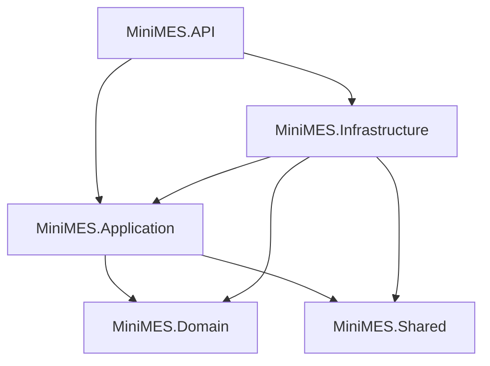

# 后端技术设计文档 (TDD)：Mini MES 系统

## 1. 技术栈选型

### 1.1 核心技术

- **框架**：.NET 8 Web API
- **数据库**：MySQL 8.0+
- **ORM**：Entity Framework Core 8 (Code-First)
- **认证**：JWT (JSON Web Token)
- **实时推送**：ASP.NET Core SignalR
- **文档**：Swagger/OpenAPI 3.0
- **日志**：Serilog
- **部署**：Linux + systemd

### 1.2 选型理由

| 技术    | 理由                                |
| ------- | ----------------------------------- |
| .NET 8  | 高性能、跨平台、成熟的企业级框架    |
| MySQL   | 开源、稳定、适合中小规模数据        |
| EF Core | Code-First 开发效率高，支持迁移管理 |
| JWT     | 无状态认证，适合 API 服务           |
| SignalR | 内置 WebSocket 抽象，支持自动降级和 JWT 认证，无需额外依赖 |

## 2. 系统架构设计

### 2.1 分层架构（Clean Architecture）

```
MiniMES.API          # Web API 层（控制器、中间件、过滤器）
  ├── Controllers/   # REST API 控制器
  ├── Hubs/          # SignalR Hub（DeviceMonitorHub）
  ├── BackgroundServices/ # 后台任务（DeviceDataSimulator）
  ├── Filters/       # 过滤器
  └── Middlewares/   # 中间件
MiniMES.Application  # 应用层（DTOs、接口定义）
  ├── DTOs/          # 数据传输对象（含 Device/DeviceStatusDto）
  └── Interfaces/    # 服务和仓储接口定义
      ├── Services/  # 业务服务接口
      └── Repositories/ # 数据访问接口
MiniMES.Domain       # 领域层（实体、枚举、领域逻辑）
MiniMES.Infrastructure # 基础设施层（接口实现）
  ├── Services/      # 业务服务实现
  ├── Repositories/  # 数据访问实现
  └── Data/          # 数据库上下文、迁移
MiniMES.Shared       # 共享层（通用工具、响应类型）
  ├── Common/        # 通用响应类（ApiResponse）
  └── Utils/         # 工具类（PasswordHasher）
```

**依赖倒置原则**：
- Application 层定义接口，Infrastructure 层实现接口
- API 层通过依赖注入使用 Application 接口
- 高层模块不依赖低层模块，都依赖抽象

### 2.2 项目依赖关系



## 3. 数据库设计

### 3.1 表结构设计

#### 用户表 (users)

```sql
CREATE TABLE users (
    id BIGINT PRIMARY KEY AUTO_INCREMENT,
    username VARCHAR(50) NOT NULL UNIQUE COMMENT '用户名',
    password_hash VARCHAR(255) NOT NULL COMMENT '密码哈希',
    real_name VARCHAR(50) NOT NULL COMMENT '真实姓名',
    role_id INT NOT NULL COMMENT '角色ID',
    status TINYINT NOT NULL DEFAULT 1 COMMENT '状态：1-启用 0-停用',
    created_at DATETIME NOT NULL DEFAULT CURRENT_TIMESTAMP,
    updated_at DATETIME NOT NULL DEFAULT CURRENT_TIMESTAMP ON UPDATE CURRENT_TIMESTAMP,
    INDEX idx_username (username),
    INDEX idx_role_id (role_id)
) ENGINE=InnoDB DEFAULT CHARSET=utf8mb4 COMMENT='用户表';
```

#### 角色表 (roles)

```sql
CREATE TABLE roles (
    id INT PRIMARY KEY AUTO_INCREMENT,
    role_name VARCHAR(50) NOT NULL UNIQUE COMMENT '角色名称',
    permissions JSON COMMENT '权限列表',
    created_at DATETIME NOT NULL DEFAULT CURRENT_TIMESTAMP,
    updated_at DATETIME NOT NULL DEFAULT CURRENT_TIMESTAMP ON UPDATE CURRENT_TIMESTAMP
) ENGINE=InnoDB DEFAULT CHARSET=utf8mb4 COMMENT='角色表';
```

#### 产品表 (products)

```sql
CREATE TABLE products (
    id BIGINT PRIMARY KEY AUTO_INCREMENT,
    product_code VARCHAR(50) NOT NULL UNIQUE COMMENT '产品编码',
    product_name VARCHAR(100) NOT NULL COMMENT '产品名称',
    specification VARCHAR(200) COMMENT '规格型号',
    status TINYINT NOT NULL DEFAULT 1 COMMENT '状态：1-启用 0-停用',
    created_at DATETIME NOT NULL DEFAULT CURRENT_TIMESTAMP,
    updated_at DATETIME NOT NULL DEFAULT CURRENT_TIMESTAMP ON UPDATE CURRENT_TIMESTAMP,
    INDEX idx_product_code (product_code),
    INDEX idx_status (status)
) ENGINE=InnoDB DEFAULT CHARSET=utf8mb4 COMMENT='产品表';
```

#### 工位表 (workstations)

```sql
CREATE TABLE workstations (
    id BIGINT PRIMARY KEY AUTO_INCREMENT,
    station_code VARCHAR(50) NOT NULL UNIQUE COMMENT '工位编号',
    station_name VARCHAR(100) NOT NULL COMMENT '工位名称',
    workshop VARCHAR(100) COMMENT '所属车间',
    status TINYINT NOT NULL DEFAULT 1 COMMENT '状态：1-启用 0-停用',
    created_at DATETIME NOT NULL DEFAULT CURRENT_TIMESTAMP,
    updated_at DATETIME NOT NULL DEFAULT CURRENT_TIMESTAMP ON UPDATE CURRENT_TIMESTAMP,
    INDEX idx_station_code (station_code),
    INDEX idx_status (status)
) ENGINE=InnoDB DEFAULT CHARSET=utf8mb4 COMMENT='工位表';
```

#### 工单表 (work_orders)

```sql
CREATE TABLE work_orders (
    id BIGINT PRIMARY KEY AUTO_INCREMENT,
    order_no VARCHAR(50) NOT NULL UNIQUE COMMENT '工单号',
    product_id BIGINT NOT NULL COMMENT '产品ID',
    target_quantity INT NOT NULL COMMENT '目标产量',
    completed_quantity INT NOT NULL DEFAULT 0 COMMENT '累计良品数',
    defect_quantity INT NOT NULL DEFAULT 0 COMMENT '累计不良品数',
    status TINYINT NOT NULL DEFAULT 0 COMMENT '状态：0-待产 1-生产中 2-已完工 3-已取消',
    created_by BIGINT NOT NULL COMMENT '创建人ID',
    created_at DATETIME NOT NULL DEFAULT CURRENT_TIMESTAMP,
    started_at DATETIME COMMENT '开工时间',
    completed_at DATETIME COMMENT '完工时间',
    updated_at DATETIME NOT NULL DEFAULT CURRENT_TIMESTAMP ON UPDATE CURRENT_TIMESTAMP,
    INDEX idx_order_no (order_no),
    INDEX idx_product_id (product_id),
    INDEX idx_status (status),
    INDEX idx_created_at (created_at),
    FOREIGN KEY (product_id) REFERENCES products(id),
    FOREIGN KEY (created_by) REFERENCES users(id)
) ENGINE=InnoDB DEFAULT CHARSET=utf8mb4 COMMENT='工单表';
```

#### 报工记录表 (work_reports)

```sql
CREATE TABLE work_reports (
    id BIGINT PRIMARY KEY AUTO_INCREMENT,
    work_order_id BIGINT NOT NULL COMMENT '工单ID',
    workstation_id BIGINT NOT NULL COMMENT '工位ID',
    good_quantity INT NOT NULL COMMENT '良品数量',
    defect_quantity INT NOT NULL DEFAULT 0 COMMENT '不良品数量',
    reported_by BIGINT NOT NULL COMMENT '报工人ID',
    reported_at DATETIME NOT NULL DEFAULT CURRENT_TIMESTAMP COMMENT '报工时间',
    created_at DATETIME NOT NULL DEFAULT CURRENT_TIMESTAMP,
    updated_at DATETIME NOT NULL DEFAULT CURRENT_TIMESTAMP ON UPDATE CURRENT_TIMESTAMP,
    INDEX idx_work_order_id (work_order_id),
    INDEX idx_workstation_id (workstation_id),
    INDEX idx_reported_at (reported_at),
    FOREIGN KEY (work_order_id) REFERENCES work_orders(id),
    FOREIGN KEY (workstation_id) REFERENCES workstations(id),
    FOREIGN KEY (reported_by) REFERENCES users(id)
) ENGINE=InnoDB DEFAULT CHARSET=utf8mb4 COMMENT='报工记录表';
```

#### 操作日志表 (operation_logs)

```sql
CREATE TABLE operation_logs (
    id BIGINT PRIMARY KEY AUTO_INCREMENT,
    user_id BIGINT NOT NULL COMMENT '操作人ID',
    operation_type VARCHAR(50) NOT NULL COMMENT '操作类型',
    operation_desc VARCHAR(500) COMMENT '操作描述',
    ip_address VARCHAR(50) COMMENT 'IP地址',
    created_at DATETIME NOT NULL DEFAULT CURRENT_TIMESTAMP,
    INDEX idx_user_id (user_id),
    INDEX idx_operation_type (operation_type),
    INDEX idx_created_at (created_at)
) ENGINE=InnoDB DEFAULT CHARSET=utf8mb4 COMMENT='操作日志表';
```

### 3.2 索引策略

- **主键索引**：所有表使用自增 BIGINT 主键
- **唯一索引**：业务编码字段（username、product_code、station_code、order_no）
- **普通索引**：高频查询字段（status、created_at、外键字段）
- **复合索引**：根据实际查询场景优化（如按工单+工位查询报工记录）

## 4. API 接口设计

### 4.1 统一响应格式

```csharp
public class ApiResponse<T>
{
    public bool Success { get; set; }
    public string Message { get; set; }
    public T Data { get; set; }
    public DateTime Timestamp { get; set; }
}

// 成功响应
{
    "success": true,
    "message": "操作成功",
    "data": { ... },
    "timestamp": "2026-03-11T10:30:00Z"
}

// 失败响应
{
    "success": false,
    "message": "工单号已存在",
    "data": null,
    "timestamp": "2026-03-11T10:30:00Z"
}
```

### 4.2 分页响应格式

```csharp
public class PagedResponse<T>
{
    public List<T> Items { get; set; }
    public int Total { get; set; }
    public int Page { get; set; }
    public int PageSize { get; set; }
}
```

### 4.3 API 路由规范

```
基础路径：/api/v1

认证模块：
POST   /api/v1/auth/login          # 用户登录
POST   /api/v1/auth/logout         # 用户登出
GET    /api/v1/auth/profile        # 获取当前用户信息

用户管理：
GET    /api/v1/users               # 获取用户列表
GET    /api/v1/users/{id}          # 获取用户详情
POST   /api/v1/users               # 创建用户
PUT    /api/v1/users/{id}          # 更新用户
DELETE /api/v1/users/{id}          # 删除用户

角色管理：
GET    /api/v1/roles               # 获取角色列表
POST   /api/v1/roles               # 创建角色
PUT    /api/v1/roles/{id}          # 更新角色
DELETE /api/v1/roles/{id}          # 删除角色

产品管理：
GET    /api/v1/products            # 获取产品列表
GET    /api/v1/products/{id}       # 获取产品详情
POST   /api/v1/products            # 创建产品
PUT    /api/v1/products/{id}       # 更新产品
DELETE /api/v1/products/{id}       # 删除产品

工位管理：
GET    /api/v1/workstations        # 获取工位列表
GET    /api/v1/workstations/{id}   # 获取工位详情
POST   /api/v1/workstations        # 创建工位
PUT    /api/v1/workstations/{id}   # 更新工位
DELETE /api/v1/workstations/{id}   # 删除工位

工单管理：
GET    /api/v1/work-orders         # 获取工单列表
GET    /api/v1/work-orders/{id}    # 获取工单详情
POST   /api/v1/work-orders         # 创建工单
PUT    /api/v1/work-orders/{id}/cancel  # 取消工单

报工管理：
POST   /api/v1/work-reports        # 提交报工
GET    /api/v1/work-reports        # 获取报工列表
GET    /api/v1/work-reports/{id}   # 获取报工详情
PUT    /api/v1/work-reports/{id}   # 修改报工
DELETE /api/v1/work-reports/{id}   # 删除报工

生产看板：
GET    /api/v1/dashboard/progress  # 实时进度监控
GET    /api/v1/dashboard/workstation-stats  # 工位产能统计
GET    /api/v1/dashboard/product-stats      # 产品产量统计
```

## 5. 核心业务逻辑设计

### 5.1 工单状态自动流转

```csharp
public class WorkOrderService
{
    // 报工后触发工单状态更新
    public async Task UpdateWorkOrderStatusAsync(long workOrderId)
    {
        var workOrder = await _repository.GetByIdAsync(workOrderId);

        // 首次报工：待产 -> 生产中
        if (workOrder.Status == WorkOrderStatus.Pending && workOrder.CompletedQuantity > 0)
        {
            workOrder.Status = WorkOrderStatus.InProgress;
            workOrder.StartedAt = DateTime.Now;
        }

        // 达标完工：生产中 -> 已完工
        if (workOrder.Status == WorkOrderStatus.InProgress &&
            workOrder.CompletedQuantity >= workOrder.TargetQuantity)
        {
            workOrder.Status = WorkOrderStatus.Completed;
            workOrder.CompletedAt = DateTime.Now;
        }

        await _repository.UpdateAsync(workOrder);
    }
}
```

### 5.2 报工数据汇总

```csharp
public class WorkReportService
{
    // 提交报工后更新工单累计数据
    public async Task SubmitWorkReportAsync(WorkReportDto dto)
    {
        using var transaction = await _context.Database.BeginTransactionAsync();

        try
        {
            // 1. 保存报工记录
            var report = new WorkReport
            {
                WorkOrderId = dto.WorkOrderId,
                WorkstationId = dto.WorkstationId,
                GoodQuantity = dto.GoodQuantity,
                DefectQuantity = dto.DefectQuantity,
                ReportedBy = _currentUser.Id,
                ReportedAt = DateTime.Now
            };
            await _reportRepository.AddAsync(report);

            // 2. 更新工单累计数据
            var workOrder = await _workOrderRepository.GetByIdAsync(dto.WorkOrderId);
            workOrder.CompletedQuantity += dto.GoodQuantity;
            workOrder.DefectQuantity += dto.DefectQuantity;
            await _workOrderRepository.UpdateAsync(workOrder);

            // 3. 触发工单状态流转
            await _workOrderService.UpdateWorkOrderStatusAsync(dto.WorkOrderId);

            await transaction.CommitAsync();
        }
        catch
        {
            await transaction.RollbackAsync();
            throw;
        }
    }
}
```

### 5.3 权限校验

```csharp
[AttributeUsage(AttributeTargets.Class | AttributeTargets.Method)]
public class RequirePermissionAttribute : Attribute
{
    public string Permission { get; }

    public RequirePermissionAttribute(string permission)
    {
        Permission = permission;
    }
}

// 使用示例
[RequirePermission("work_order:create")]
public async Task<IActionResult> CreateWorkOrder([FromBody] CreateWorkOrderDto dto)
{
    // ...
}
```

## 6. 安全设计

### 6.1 密码加密

```csharp
// 使用 BCrypt 进行密码哈希
public class PasswordHasher
{
    public string HashPassword(string password)
    {
        return BCrypt.Net.BCrypt.HashPassword(password);
    }

    public bool VerifyPassword(string password, string hash)
    {
        return BCrypt.Net.BCrypt.Verify(password, hash);
    }
}
```

### 6.2 JWT 认证

```csharp
public class JwtService
{
    public string GenerateToken(User user)
    {
        var claims = new[]
        {
            new Claim(ClaimTypes.NameIdentifier, user.Id.ToString()),
            new Claim(ClaimTypes.Name, user.Username),
            new Claim(ClaimTypes.Role, user.Role.RoleName)
        };

        var key = new SymmetricSecurityKey(Encoding.UTF8.GetBytes(_configuration["Jwt:Key"]));
        var credentials = new SigningCredentials(key, SecurityAlgorithms.HmacSha256);

        var token = new JwtSecurityToken(
            issuer: _configuration["Jwt:Issuer"],
            audience: _configuration["Jwt:Audience"],
            claims: claims,
            expires: DateTime.Now.AddHours(8),
            signingCredentials: credentials
        );

        return new JwtSecurityTokenHandler().WriteToken(token);
    }
}
```

## 7. 异常处理

### 7.1 全局异常处理中间件

```csharp
public class GlobalExceptionMiddleware
{
    public async Task InvokeAsync(HttpContext context, RequestDelegate next)
    {
        try
        {
            await next(context);
        }
        catch (BusinessException ex)
        {
            await HandleBusinessExceptionAsync(context, ex);
        }
        catch (Exception ex)
        {
            await HandleUnknownExceptionAsync(context, ex);
        }
    }

    private async Task HandleBusinessExceptionAsync(HttpContext context, BusinessException ex)
    {
        context.Response.StatusCode = 400;
        context.Response.ContentType = "application/json";

        var response = new ApiResponse<object>
        {
            Success = false,
            Message = ex.Message,
            Data = null,
            Timestamp = DateTime.Now
        };

        await context.Response.WriteAsJsonAsync(response);
    }
}
```

## 8. 日志设计

### 8.1 Serilog 配置

```json
{
  "Serilog": {
    "MinimumLevel": {
      "Default": "Information",
      "Override": {
        "Microsoft": "Warning",
        "System": "Warning"
      }
    },
    "WriteTo": [
      {
        "Name": "Console"
      },
      {
        "Name": "File",
        "Args": {
          "path": "logs/minimes-.log",
          "rollingInterval": "Day",
          "retainedFileCountLimit": 30
        }
      }
    ]
  }
}
```

## 9. 部署架构

### 9.1 生产环境部署

```
┌─────────────────────────────────────┐
│         Nginx (反向代理)             │
│         Port: 80/443                │
└──────────────┬──────────────────────┘
               │
┌──────────────▼──────────────────────┐
│      MiniMES.API (systemd)          │
│      Port: 5000                     │
└──────────────┬──────────────────────┘
               │
┌──────────────▼──────────────────────┐
│      MySQL 8.0                      │
│      Port: 3306                     │
└─────────────────────────────────────┘
```

### 9.2 systemd 服务配置

创建服务文件 `/etc/systemd/system/minimes.service`：

```ini
[Unit]
Description=MiniMES API Service
After=network.target

[Service]
WorkingDirectory=/var/www/minimes
ExecStart=/usr/bin/dotnet /var/www/minimes/MiniMES.API.dll
Restart=always
RestartSec=10
Environment=ASPNETCORE_ENVIRONMENT=Production
Environment=ASPNETCORE_URLS=http://localhost:5000
User=www-data

[Install]
WantedBy=multi-user.target
```

### 9.3 Nginx 配置

创建站点配置 `/etc/nginx/sites-available/minimes`：

```nginx
server {
    listen 80;
    server_name your-domain.com;

    location /api/ {
        proxy_pass http://localhost:5000/;
        proxy_http_version 1.1;
        proxy_set_header Upgrade $http_upgrade;
        proxy_set_header Connection keep-alive;
        proxy_set_header Host $host;
        proxy_cache_bypass $http_upgrade;
        proxy_set_header X-Forwarded-For $proxy_add_x_forwarded_for;
        proxy_set_header X-Forwarded-Proto $scheme;
    }

    location / {
        root /var/www/minimes/frontend;
        try_files $uri $uri/ /index.html;
    }
}
```

## 10. 性能优化策略

### 10.1 数据库优化

- 使用索引优化高频查询
- 使用连接池管理数据库连接
- 对大数据量查询使用分页
- 使用 EF Core 的 AsNoTracking() 优化只读查询

### 10.2 缓存策略

- 基础数据（产品、工位）使用内存缓存
- 看板数据使用短期缓存（5 秒）
- 用户权限信息缓存到 JWT Token

### 10.3 并发控制

- 报工提交使用数据库事务保证一致性
- 工单状态更新使用乐观锁防止并发冲突

## 11. 测试策略

### 11.1 单元测试

- 使用 xUnit 框架
- 覆盖核心业务逻辑（工单状态流转、报工汇总）
- 目标覆盖率：80%+

### 11.2 集成测试

- 测试 API 接口的完整流程
- 使用 TestServer 进行集成测试
- 使用内存数据库或测试数据库

### 11.3 性能测试

- 使用 JMeter 或 k6 进行压力测试
- 测试报工接口的并发性能
- 验证系统在 100 并发下的响应时间

## 12. 实时推送架构（SignalR）

### 12.1 组件说明

| 组件 | 位置 | 职责 |
|------|------|------|
| `DeviceMonitorHub` | `MiniMES.API/Hubs/` | SignalR Hub，处理客户端连接/断开，管理 Group 订阅 |
| `DeviceDataSimulator` | `MiniMES.API/BackgroundServices/` | BackgroundService，每秒生成模拟数据并推送 |
| `DeviceStatusDto` | `MiniMES.Application/DTOs/Device/` | 设备状态数据契约 |

> `DeviceDataSimulator` 放在 API 层而非 Infrastructure 层，原因是它直接依赖 `IHubContext<DeviceMonitorHub>`，属于表现层关注点。

### 12.2 数据流

```
DeviceDataSimulator（每秒）
  → IHubContext<DeviceMonitorHub>.Clients.Group("all-devices")
  → SendAsync("ReceiveDeviceStatus", List<DeviceStatusDto>)
  → 所有已连接客户端
```

### 12.3 JWT 认证集成

SignalR WebSocket 握手时无法设置自定义 Header，通过 query string 传递 token：

```csharp
// Program.cs — JWT 事件配置
options.Events = new JwtBearerEvents
{
    OnMessageReceived = ctx =>
    {
        var token = ctx.Request.Query["access_token"];
        if (!string.IsNullOrEmpty(token) && ctx.Request.Path.StartsWithSegments("/hubs"))
            ctx.Token = token;
        return Task.CompletedTask;
    }
};
```

### 12.4 CORS 配置

SignalR 需要 `AllowCredentials()`，不能与 `AllowAnyOrigin()` 同时使用，因此使用独立策略：

- REST API：`AllowAll` 策略（`AllowAnyOrigin`）
- SignalR Hub：`AllowFrontend` 策略（`WithOrigins` 从配置读取 + `AllowCredentials`）

允许来源在 `appsettings.json` 的 `Cors.AllowedOrigins` 中配置，支持多环境覆盖。

### 12.5 Hub 端点

```
WebSocket: ws://host/hubs/device-monitor
协商:      POST /hubs/device-monitor/negotiate
```

客户端事件：

| 事件 | 方向 | 说明 |
|------|------|------|
| `ReceiveDeviceStatus` | 服务端 → 客户端 | 推送 `DeviceStatusDto[]` |
| `SubscribeDevice(deviceId)` | 客户端 → 服务端 | 加入设备专属 Group |
| `UnsubscribeDevice(deviceId)` | 客户端 → 服务端 | 离开设备专属 Group |
